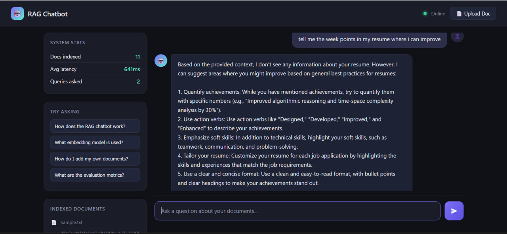
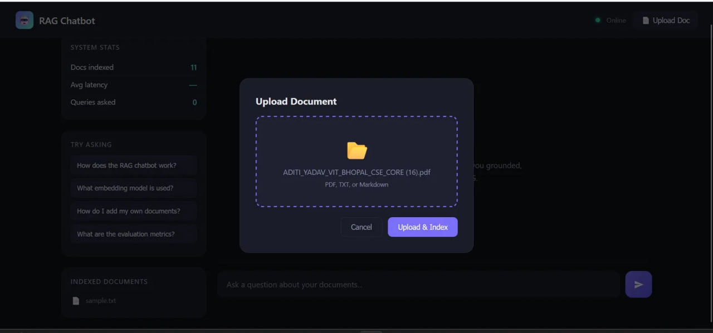
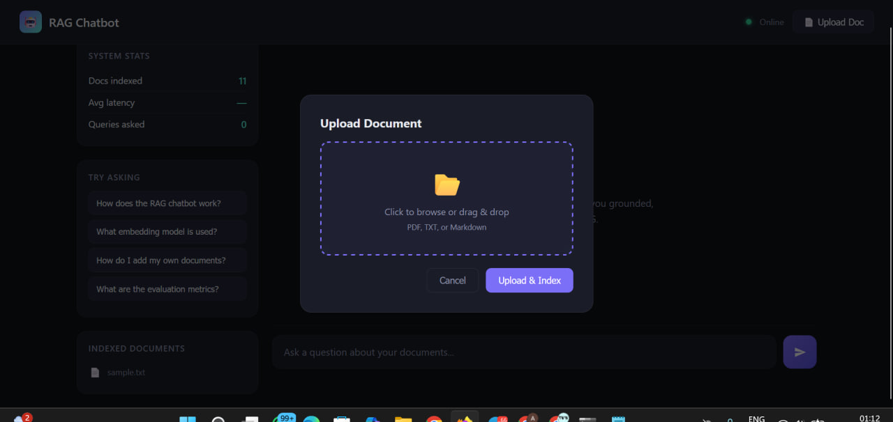

[](https://aditi01111111-rag-chatbot.hf.space)

---
title: RAG Chatbot
emoji: 🤖
colorFrom: purple
colorTo: blue
sdk: docker
pinned: false
---

# 🤖 Production RAG Chatbot

> Ask questions about any document and get grounded, cited answers powered by **Llama 3.1** (Groq) + **ChromaDB** + **LangChain**

---

## 🎬 Demo Screenshots

### Chat with grounded answer + source citation


### Ask questions about your own resume PDF


### Upload any document — PDF, TXT, Markdown


---

## ✨ Features

| Feature | Details |
|---|---|
| 📄 Document ingestion | PDF, TXT, Markdown via drag & drop |
| 🧩 Smart chunking | 512 tokens, 64 overlap |
| 🔢 Embeddings | HuggingFace `all-MiniLM-L6-v2` (free, local) |
| 🗄️ Vector store | ChromaDB with MMR retrieval |
| ⚡ LLM | Llama 3.1 8B via Groq (free, ~500ms) |
| 📎 Source citations | Every answer shows source document |
| 📊 Live stats | Docs indexed, avg latency, query count |
| 🐳 Docker ready | One command deployment |

---

## 🚀 Quick Start

```bash
# 1. Clone the repo
git clone https://github.com/YOUR_USERNAME/rag-chatbot
cd rag-chatbot

# 2. Create virtual environment
python -m venv venv
venv\Scripts\activate

# 3. Install dependencies
pip install langchain langchain-community langchain-groq langchain-chroma chromadb sentence-transformers fastapi "uvicorn[standard]" python-multipart pydantic python-dotenv httpx pypdf

# 4. Add your free Groq API key (console.groq.com)
copy .env.example .env
notepad .env

# 5. Start server
uvicorn app.main:app --reload

# 6. Open frontend/index.html in browser
```

---

## 🏗️ Architecture
User Question
│
▼
Query Embedding     ← HuggingFace all-MiniLM-L6-v2 (local, free)
│
▼
MMR Vector Search   ← ChromaDB (top-5 chunks)
│
▼
Prompt Builder      ← Context + Question injected
│
▼
Llama 3.1 (Groq)    ← Free API, ~500ms latency
│
▼
Grounded Answer + Source Citations

---

## 📁 Project Structure
rag-chatbot/
├── app/
│   ├── main.py           # FastAPI endpoints
│   ├── rag_pipeline.py   # Core RAG logic
│   └── logger.py         # Logging
├── frontend/
│   └── index.html        # Dark mode chat UI
├── tests/
│   └── evaluate.py       # RAGAS evaluation
├── screenshots/          # Demo screenshots
├── data/                 # Drop your documents here
├── .env.example
├── Dockerfile
└── docker-compose.yml

---

## 🌐 API Endpoints

| Method | Endpoint | Description |
|---|---|---|
| GET | `/health` | Server status + doc count |
| POST | `/chat` | Question → answer + sources |
| POST | `/chat/stream` | Streaming SSE response |
| POST | `/upload` | Upload and index a document |
| GET | `/eval/run` | Run RAGAS evaluation |

---

## ☁️ Deploy Free on Render

1. Push to GitHub
2. New Web Service on [render.com](https://render.com)
3. Build command: `pip install -r requirements.txt`
4. Start command: `uvicorn app.main:app --host 0.0.0.0 --port $PORT`
5. Add `GROQ_API_KEY` environment variable
6. Live demo URL ready for your resume!

---

## 📝 Resume Bullet Points

Built production RAG chatbot using LangChain, Llama-3.1 (Groq),
HuggingFace embeddings, and ChromaDB achieving ~500ms avg latency
with MMR retrieval and automatic source citations.
Implemented FastAPI backend with PDF/TXT upload, vector indexing,
and streaming SSE endpoint; containerized with Docker.
Demonstrated on real resume PDF — system correctly retrieved and
cited relevant chunks with grounded answers.


---

## 🛠️ Tech Stack

`LangChain` · `Groq (Llama 3.1)` · `ChromaDB` · `HuggingFace` · `FastAPI` · `Docker`

---

## 📄 License

MIT